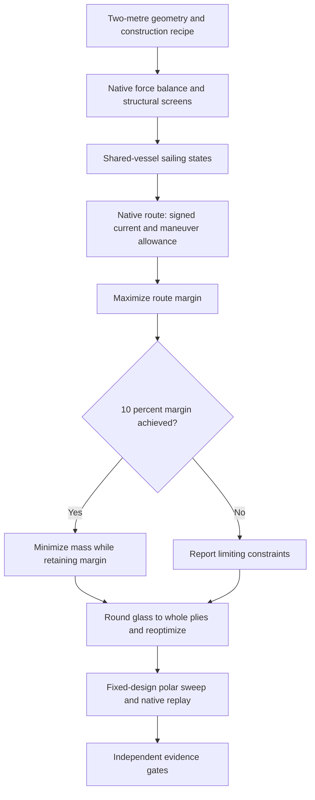
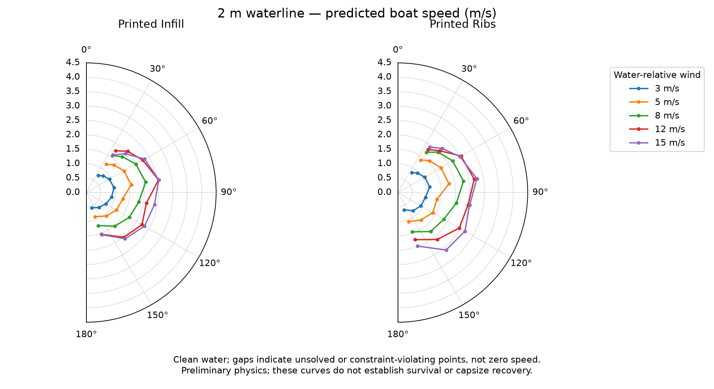

# Establishing a two-metre baseline

The current [generated study](mission-sizing-results.md) fixes **waterline length** at 2 m while optimizing the remaining geometry, ballast, energy system and laminate recipe. Overall length and transport envelope still need CAD definition. Size reduction follows a credible baseline; it is not the current objective.

## What the optimizer now asks

A shared vessel must balance drive, side force, yaw and heel at the route's four sailing points. The native SysML route calculation consumes those solved water-relative VMGs, adds signed current and retains a separate 5% maneuver allowance. It maximizes the minimum margin across upstream mean progress, downstream mean progress and passage duration. Mass minimization begins only after reaching 10% route margin. This is a route margin, not a claim of 10% reserve in every structural constraint.

The illustrative easterly profile has equal time fractions at 5 and 8 m/s water-relative wind, paired with 0.5 and 1.0 m/s current. Upstream is windward; downstream is downwind. The profile is a synthetic scenario, not measured weather availability. Wind relative to shore must be converted to the water frame before using these polars. There is no blanket 20% performance deduction and no assumed safe waiting: negative progress is counted, and a nonpositive leg mean prevents a passage claim. Waves, cross-current routing, banks, traffic, weed states and safe hold opportunities are not represented by this profile.

The optimization solves the route-supporting sailing points directly, rather than interpolating an unconverged polar grid. A separate fixed-design sweep checks wind and heading coverage. Failed grid solves remain explicit missing data; they are neither zero-speed predictions nor evidence of impossibility. A later spatial/time route planner can consume validated polars.

## Construction and handling

Two declared construction options share the same glass-skin bending model. The conventional option retains 8% volumetric foil infill. The ribbed option uses 0.8 mm full-section transverse printed ribs at 40 mm pitch, giving 2% equivalent core volume. This accounts for rib mass, but does not prove local skin buckling, rib loads or adhesion. No unmodeled spar stiffness is credited. A separate spar architecture remains an extension requiring explicit geometry, mass and load transfer rather than a favorable coefficient.

The wing, battery and keel are removable. Each must meet P-102 independently; the remaining hull/equipment assembly must also meet 15 kg. A 0.6 kg attachment allowance is carried at the waterline and remains with the hull for transport. Detailed fittings, waterproof connectors, setup time and module dimensions require design and verification. Total vessel mass may exceed 15 kg.

Glass is rounded upward to whole 200 g/m² plies and the remaining dimensions and sailing states are reoptimized. This is a discrete recipe candidate, not a global integer optimum. Five initial geometries are searched per construction option. Material allowables, hull/foil coefficients and the structural assumptions retain their [documented limitations](structure-sizing.md).

## Stability and recovery

A new preliminary screen puts the loaded center of gravity at least 20 mm below the hull bottom. It uses the corrected mass moment from the same native hydrostatic model, including shell and appendage masses. It is a proposed conservative design allocation linked to N-051, not a derivation that N-051 logically requires this particular CG position.

This removes the incentive to rely only on broad-beam initial stability and zero ballast. It is **not** a full-angle righting curve: enclosed-wing buoyancy, inverted equilibria, downflooding, dynamic recovery and minimum-load stability remain unmodeled. The existing N-051 capsize release matrix and N-052 control recovery requirements remain authoritative. No full-angle or capsize success is inferred from a positive CG margin.

`BlueDogMissionSizing::Readiness` requires numerical fit, full-angle stability, capsize releases, control recovery, construction proof, validated polars and route evidence. Evidence defaults to false. A successful sizing solve cannot independently mark the vessel mission-ready.

## Reproduction and next decisions

Run the commands in the [modeling guide](../models/README.md). [mission-sizing.sysml](../models/mission-sizing.sysml) owns the construction, handling, stability and route equations; SciPy searches their compiled native implementation. Publication replays every selected operating point and both route summaries in the native interpreter and checks them against compiled results. The JSON record includes source hashes, all starts, rounded designs and attempted polar points.

Before reducing length, resolve the generated result's limiting margins, measure mass/stiffness with wet manufactured coupons, obtain credible hull resistance and wing polar data, and evaluate full-angle stability for actual enclosed geometry. A numerical route fit alone is not the baseline acceptance criterion.

The [sail architecture trade](sail-trade.md) now defines the candidate-specific work needed before applying these generic-wing results to a particular rig. The present sizing model does not yet include a tail, counterweight, fixed-camber square/reaching-mode polars or soft-sail control system.
