# SV Blue Dog: picking up a small sailing robot again

I wanted to explore how far I could get with autonomous sailing and desktop manufacturing. I wanted to learn about sailing, build something cool, and develop a complete system: the boat, the electronics, the controls, and the decisions that would let it look after itself.

The original inspiration was Microtransat. My version was an even more micro "trans-gorge" sailboat. Could I build a small robot that would complete the Gorge Blowout course? Could it go further, sailing from Bonneville to The Dalles and back?

That was the ambition behind SV Blue Dog. I am picking it up again with the original design notes and CAD, and returning to the questions that made me want to build it.

## What would a trans-gorge boat need to do?

I envisioned a robot I could "set and forget." I wanted to give it a mission and have it handle the sailing, manage its energy, and recover from the kinds of problems that would otherwise end the trip.

The round-trip idea gave me a concrete mission to think about. Getting somewhere was only part of it; I wanted the boat to bring itself back. How small could I make a system capable of that? What would I need to understand about sailing to make good decisions about the hull, rig, and controller?

Those questions were part of the appeal. This was a way to learn about sailing by trying to build something that could do it for itself.

## How much of the boat could I make on a desktop?

Desktop manufacturing was central to the idea. My December 2023 notes describe a one-metre monohull with a printable hull, a fin keel, and a ballast bulb. I wanted to balance efficiency and reliability with something I could actually manufacture.

I set an ambitious target for the frame: a bill of materials below $100 and less than four hours of labour. That was a design target for the frame, not a measured cost for a finished boat. The notes also call for a printable hull cross-section of 250 by 250, although I still need to confirm the units against the CAD.

The [CAD files](../cad/) include hull sections, boat and mast assemblies, a keel shell, and several sail or wing variants. That is the design work I am returning to. The next step is to sort through those alternatives and establish which configuration to carry forward.

## What does "set and forget" ask of the design?

That ambition shows up clearly in the failure cases I wrote down. The boat should right itself from a fully inverted position, resist catching weeds, and recover from a software reset. A small hull breach had a proposed response: a bilge pump. Battery exhaustion had another: a low-energy "limp mode."

Each of those ideas opens up a more specific question. What should the boat keep doing when energy runs low? What does it need to remember after a reset? How would it detect water ingress, and what could it recover from? Self-righting also needs to become a demonstrated property of the boat and rig together.

My notes include communication and COLREGs compliance as goals, too. These are still design questions to work through; the brief records what I wanted the system to handle, rather than results showing that it can.

## Bringing the whole system together

The electronics sketch separates the autopilot, communications, AIS, and air-data functions. It includes an STM32 H7-based autopilot concept, inertial and magnetic sensing, GNSS, logging, battery monitoring, and energy harvesting. CAN appears in both the autopilot and air-data board notes. I also considered cellular communication and a possible RockBLOCK satellite modem.

The detailed candidate parts are in the [project notes](project-status.md). What interests me now is how those pieces fit together: what information the boat needs to sail, how it uses that information, and how much energy it takes to keep the whole system running. The hardware list was a starting point for that work.

The current [logical architecture](architecture.md) now breaks down the boat's subsystems, including recovery propulsion and communications equipment. I want a boat I can transport myself and build with a desktop 3D printer, so handling, manufacture, and service access now have their own requirements. Use cases connect the missions to those requirements; design satisfaction links identify which parts are intended to meet them. Those links still need test evidence.

I am also separating the regulatory questions from assumptions about size. Being small and unattended does not by itself make the boat an exempt buoy. The [operating constraints](operating-constraints.md) record the sources and questions still to resolve.

```mermaid
---
config:
  fontFamily: "Helvetica, Arial, sans-serif"
  theme: base
  themeCSS: ".edgeLabel rect { opacity: 1 !important; } .cluster-label .nodeLabel { text-align: center; }"
  themeVariables:
    fontFamily: "Helvetica, Arial, sans-serif"
    fontSize: "14px"
    primaryColor: "#FFFFFF"
    secondaryColor: "#FFFFFF"
    tertiaryColor: "#FFFFFF"
    background: "#FFFFFF"
    primaryBorderColor: "#181818"
    primaryTextColor: "#000000"
    lineColor: "#181818"
    textColor: "#000000"
    noteBkgColor: "#FEFFDD"
    noteBorderColor: "#181818"
    noteTextColor: "#000000"
    clusterBkg: "#FFFFFF"
    clusterBorder: "#181818"
    edgeLabelBackground: "#FFFFFF"
---
%% BlueDogArchitectureViews::architecture — definition rendering (view def GeneralView, filter @PartDefinition)
flowchart TB
  n0["`*«part def»*
**Boat**`"]
  n1["`*«part def»*
**NavigationSignaling**`"]
  n2["`*«part def»*
**HullAndRig**`"]
  n3["`*«part def»*
**EnergySubsystem**`"]
  n4["`*«part def»*
**NavigationAndSensing**`"]
  n5["`*«part def»*
**GuidanceAndControl**`"]
  n6["`*«part def»*
**SailAndSteeringActuation**`"]
  n7["`*«part def»*
**Communications**`"]
  n8["`*«part def»*
**HealthAndRecovery**`"]
  n9["`*«part def»*
**DataRecording**`"]
  n10["`*«part def»*
**ObservationPayload**`"]
  n0 ---|"◆ hullAndRig"| n2
  n0 ---|"◆ energy"| n3
  n0 ---|"◆ navigation"| n4
  n0 ---|"◆ control"| n5
  n0 ---|"◆ actuation"| n6
  n0 ---|"◆ communications"| n7
  n0 ---|"◆ recovery"| n8
  n0 ---|"◆ recording"| n9
  n0 ---|"◆ signaling"| n1
  n0 ---|"◆ observationPayload"| n10
```

<!-- diagram:architecture -->

<!-- /diagram -->

## Could it do something useful while it was out there?

I also liked the possibility of collecting interesting data. One idea was a persistent swell monitor: could the boat keep station in an area and measure conditions over time?

That adds another question to the journey. Completing a course gives the robot a destination; monitoring asks it to stay somewhere useful. I would need to work out what station keeping means for this boat, what measurements would be useful, and how to interpret them from a moving platform. For now, it is a possibility I want to explore.

## Using SysML v2 to work through the requirements

Learning SysML v2 is now another goal for the project. I want to use it to decompose the mission and connect the electronics requirements back to the reasons for them. I started with sysmlpy, which I have been using at work. Exploring requirement derivation led me further into the language and its standard libraries. I am now moving the project to OpenMBEE's OpenSysML implementation so I can build toward executable models as well as diagrams. The current mission and requirements are still a discussion model; they do not yet demonstrate that the boat can complete the mission.

The challenge is becoming more concrete: sail from The Dalles to Bonneville and back without intervention. One round trip is the threshold; keeping the boat going for repeated trips is the objective. I want to watch it live, but it needs to keep sailing if the monitoring link drops. The longer-term ambition is a voyage to Hawai'i, with the Gorge serving as a torture test for the system.

I have separated the [challenge brief](challenge-brief.md) from the vehicle design. Its own SysML file defines what counts, and the boat requirements import it. That lets me work on how to build Blue Dog without quietly changing the challenge to fit the design. Microtransat remains the inspiration for the brief. An auxiliary motor can help during testing and remain aboard for vessel recovery. Using it during a challenge attempt ends that attempt without qualification.

The model now has two top-level requirements: the Trans-Gorge challenge and the eventual Hawaii voyage. The Gorge gives me a demanding proving ground while the ocean goal keeps the longer-term design needs visible. Its departure point, route, and acceptance criteria still need definition.

The native OpenSysML diagram shows proposed derivations from both mission drivers into vehicle requirements, with arrows pointing from each derived requirement back to its original. The linked register records requirement statements and derivation rationale. None of these links establishes that the boat satisfies a requirement.

Explore the [focused requirements views](requirements-views.md), starting with the [Trans-Gorge challenge](figures/requirements-c-000.md) and [Hawaii objective](figures/requirements-h-001.md). Each parent has its own small diagrams and links to the next level.

The diagram is generated from explicit relationships in the SysML source. The [mission and requirements notes](mission-and-requirements.md) contain the details and open questions; the [generated register](requirements-register.md) records the rationale for each arrow.

## Picking up the thread

The original motivation still holds: learn about sailing, see what I can make with desktop tools, and bring a complete autonomous system together. The trans-gorge mission gives that work a direction, and the swell-monitor idea gives me another reason to keep thinking about endurance and station keeping.

I am starting by revisiting the CAD and the old requirements, documenting the current build status, and choosing the next questions to test. This is where I will keep the journey: the designs I try, the things I learn, and how those results change the boat.

### Making the environment and traffic explicit

The model now includes numerical Gorge and ocean operating and survival targets, plus immersion, thermal, material-aging and self-righting acceptance criteria. These are design targets to test, not performance the boat has demonstrated. The [environmental envelope](environmental-envelope.md) explains the baseline and its limits.

Other vessels now appear explicitly in the operating context and the voyage, recovery, collision-avoidance and signaling use cases. The design has to encounter non-AIS traffic as well as vessels broadcasting their position.

Further reading of the Microtransat group uncovered the reported USCG basis for its 2.4 m oceanographic-device interpretation, and a newer discussion pointing to the actual UK small-MASS certification exemption. The [classification research](operating-constraints.md) separates those sources and the unresolved US applicability question.

### Turning intentions into acceptance criteria

The printable build envelope is now 250 × 250 × 250 mm, measured around the entire oriented print job rather than by part volume. The environmental model now has separate Gorge/ocean profiles and individual parameter requirements, with explicit milfoil passage, snag shedding and blockage response. Eight native SysML predicates can evaluate supplied print dimensions, recovery timing, reserve sizing, navigation availability, launch admission and motor qualification state; synthetic passing and failing examples exercise the criteria without claiming the boat has passed a physical test.

The [verification plan](verification-plan.md) identifies remaining evidence and proposed engineering targets. A [water-versus-air propeller trade study](recovery-propulsion-trade.md) compares recovery propulsion against energy, weed tolerance, guarding and capsize constraints. The propulsion medium remains open.

The recovery-propulsion trade now has an [executable SysML analysis case](../models/recovery-trade.sysml). It compares the two fluids at their respective inflow speeds, estimates electrical demand and checks the recovery reserve. The example numbers are illustrative; weed and capsize evidence remain explicit gates, so an energy calculation alone cannot select the design.

An [independent requirements audit](requirements-audit.md) caught gaps in navigation sampling, energy admission, mode precedence and derivation rationale. The corrected model separates launch energy and motor inhibition, distinguishes Gorge from ocean qualification, and retains physical evidence gaps explicitly.

The next lesson was that a measurable paragraph can still hide several requirements. I have [split 29 bundled requirements into individual acceptance leaves](requirement-decomposition.md), keeping the old IDs as parents. A boat that sheds a weed but still cannot steer should not pass a single vague weed-tolerance check. Speed recovery and steering recovery now get separate results from the same trial, just as restarting on time is separate from preserving mission state. The executable checks now sit on the particular outcomes they measure.

### Can it keep going?

I have started turning the endurance goal into an [executable energy model](sustained-operations.md). Individual loads now roll up into a budget, and the battery balance follows the order of the day: long periods without harvesting, then a limited charging window. Charging losses, capacity limits, peak demand and the recovery reserve all matter.

The first synthetic example passes the numerical 72-hour checks, but its worst overnight margin is only about 2.7 Wh above the recovery reserve. That makes the next question concrete: measure the loads and establish credible harvesting bounds. The native verification case stays inconclusive until that evidence is accepted. A favorable daily average is useful, but it cannot rescue a boat that runs out of usable energy before sunrise.

### Keeping the requirements readable

I found that the requirements were becoming a mixture of obligations, explanations and test instructions. I have separated those: each requirement now has a concise statement, while [qualification conditions, rationale and verification plans](requirements-context.md) live in distinct model elements. The limits still matter; they are easier to find without repeating them in every sentence. A planned verification case remains inconclusive until there is evidence behind it.
