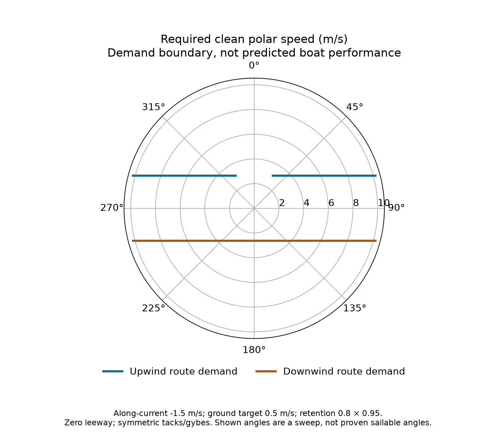
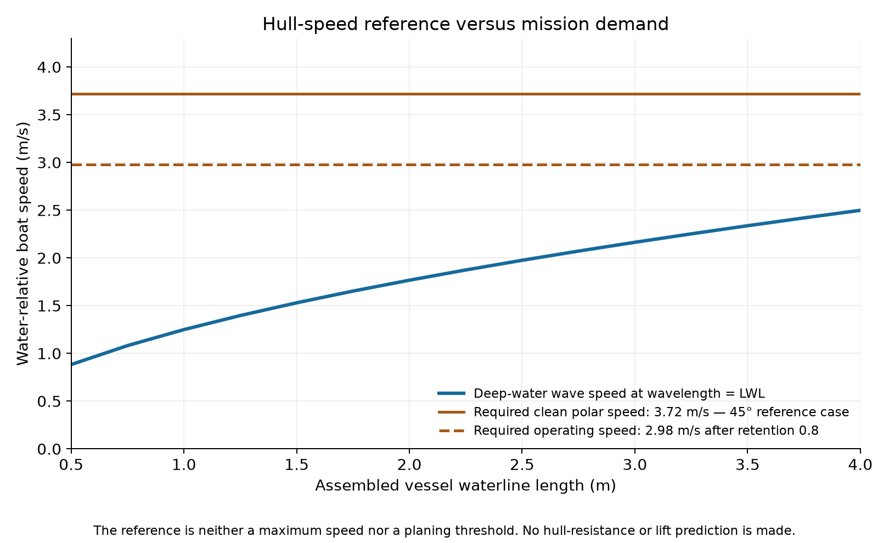
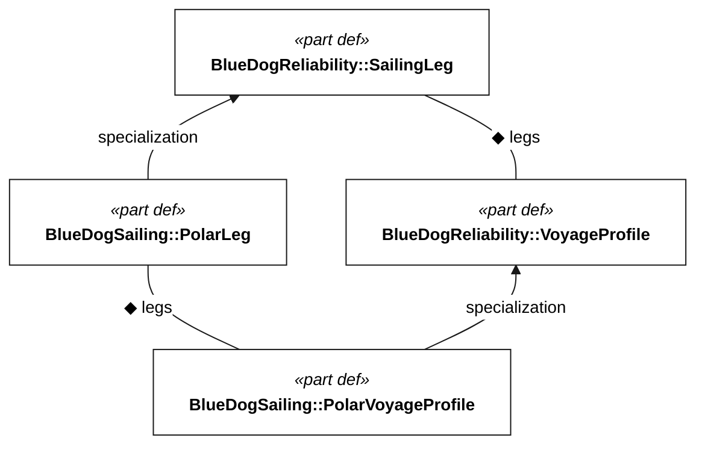

# Sailing performance: required polars and hull regime

This study works backward from the mission: how much **water-relative boat speed**, at which sailing angles, would deliver the required ground progress and passage time? It then compares that demand with a hull-length reference. It does not predict the performance of the prototype CAD or a future challenge vessel.

The executable source is [sailing-performance.sysml](../models/sailing-performance.sysml). Read the [generated results and inputs](sailing-performance-results.md) or [native analysis output](analysis/sailing-performance.json) for current values. The calculations reuse the existing Q-101 progress and Q-102 duration criteria; Q-101 retains its proposed-target status. Scenario assumptions are examples, not additional requirements.

## From a polar point to mission progress

A polar gives water-relative boat speed versus true wind speed and angle. VMG is the component useful to the route; a fast reach is not necessarily a fast passage. A VPP predicts the polar by balancing sailing forces against resistance and stability constraints. This inverse study specifies the performance needed before attempting that prediction. [ORC speed-guide explanation](https://orc.org/uploads/files/Rules-Regulations/2023/Speed-Guide-Explanation-2023.pdf)

For a route along the wind axis, symmetric tacks or gybes cancel lateral displacement. With water-relative track angle `beta` to the route:

```text
water VMG  = clean polar speed × cos(beta) × maneuver retention
 ground VMG = water VMG × environmental retention + along-route current
 ground target = max(Q-101-compatible progress target, distance / allocated moving time)
 required clean polar speed = max(0, ground target − current)
                              / (cos(beta) × maneuver retention × environmental retention)
```

Leeway changes track angle before taking the projection. Maneuver retention averages lost sailing progress; current continues throughout. Environmental retention scales through-water speed for losses not already included in the reference polar. A measured degraded polar must not receive the same derating twice. Nonpositive projection or invalid inputs cannot pass the assessment.

The selected allocations reserve time for both river legs and separate holds. The downstream leg therefore has a time-budget demand as well as the minimum-progress floor. Both allocations plus holds must fit the qualified mission duration. More detailed routing may redistribute those allocations.



These curves are **demand boundaries**, not achievable polars or a prescription to meet every sampled angle. At each relevant wind strength, a candidate needs an achievable heading pair that supplies sufficient VMG. Sailable angles, tack success and transient losses need evidence. The generated wind-strength comparison shows how demanding the same speed target becomes in lighter wind; it does not assume boat speed scales linearly with wind speed.

## Current and wind must be kept separate

The idealized westerly case runs upstream downwind and returns downstream upwind; an easterly reverses the points of sail. These are sensitivity cases, not a forecast. Holding the maximum current-envelope value over an entire leg is a stress scenario, not a surveyed river-current profile. Upstream must not be treated as a synonym for upwind.

The polar uses **water-relative true wind**. Convert ground-referenced wind using the current vector before choosing a polar point; apparent wind measured on the moving boat needs the corresponding motion correction. The initial model assumes steady wind aligned with a straight route, symmetric tacks/gybes, zero cross-current and sufficient maneuvering room. River bends, exclusion zones, traffic, unequal tacks and gusts require a vector routing model. The scalar analysis does not demonstrate corridor compliance.

## Hull speed is a reference, not a ceiling

The deep-water wave-speed reference for a wavelength equal to loaded waterline length is:

```text
reference speed = sqrt(g × LWL / (2π))
length Froude number = water-relative boat speed / sqrt(g × LWL)
```

This is approximately the familiar `1.34 × sqrt(LWL in feet)` knots, at a length Froude number near 0.40. It identifies a useful wave-making scale, not an absolute maximum. Length alone cannot establish available speed. [MIT: boat length and speed](https://engineering.mit.edu/ask-an-engineer/what-is-the-relationship-between-the-length-of-a-boat-and-its-maximum-speed)



The comparison uses boat speed through water, **not ground speed or VMG**. It reports both the required clean polar speed and the lower operating speed after environmental degradation. Maneuver losses reduce average progress; they do not directly reduce the instantaneous speed used for hull resistance.

The inverse wave-reference length in the results is a comparison point, not a minimum required boat length. A 250 mm printer constrains component build envelopes, not the waterline of an assembled hull.

| Candidate approach | What the demand means | Evidence needed before taking speed credit |
| --- | --- | --- |
| Conventional displacement monohull | A large excess over the wave-speed reference challenges a simple low-speed design assumption. | Loaded resistance curve, available sail drive, stability, leeway and appendage drag. |
| Slender displacement hull or multihull | Reduced wave-making resistance can permit higher length-based Froude numbers without asserting planing. | Hull proportions, displacement and wetted area, plus righting, capsize and handling trade-offs. |
| Planing or partial dynamic support | Dynamic lift may reduce immersed volume, but the transition and steady regime must be demonstrated. | Bottom geometry, loading, trim, center of gravity, resistance and stability over the transition, including waves and steering. |
| Surfing or foils | Potential speed gains depend on conditions or a separate lifting system. | Availability, control, structural loads and vegetation tolerance; intermittent gains cannot be assumed as sustained cruise. |

ORC's resistance model uses Froude number together with hull geometry and length/volume measures, illustrating why a speed/length comparison is only screening. Planing methods evaluate lift, drag and running attitude for a particular geometry and loading; crossing a Froude value alone does not establish the regime. [ORC VPP documentation, §6.3](https://orc.org/uploads/files/ORC-VPP-Documentation-2023.pdf), [MIT planing-hull experimental and computational study](https://dspace.mit.edu/server/api/core/bitstreams/55ba3fff-6f0d-4633-a2bb-6e53dadf0616/content)

## Carry the result into the mission model

`PolarLeg` specializes the existing `SailingLeg`; its computed water VMG flows into ground speed, travel time and the [cruise/reliability assessment](cruise-reliability.md). The two river scenarios therefore report passage exposure and the corresponding failure-rate budget from candidate polar points. Their speed inputs are synthetic; every evidence-backed voyage claim remains false.

<!-- diagram:sailing-integration -->

<!-- /diagram -->

The offshore sizing probe shows how distance and time allocation can drive polar demand without the river's adverse current. Its route length and duration are deliberately illustrative. Hawaii departure, route, season and endurance qualification remain open; it is not a Hawaii performance baseline. A suitable polar alone does not establish the [energy case](sustained-operations.md), mission reliability or seakeeping capability.

The next design decision is a candidate loaded hull/rig configuration. Measure displacement, waterline, wetted geometry and stability; obtain resistance and loaded sailing points over the relevant winds and sea states; then replace the synthetic speeds and assess tack/gybe losses, leeway and weeds. This separates a demonstrable high-speed concept from an assumption that a small boat will simply plane.

## Reproduce

Run `uv run python scripts/render_requirements.py` and `uv run pytest tests/test_sailing_performance.py -q`. SysML owns the equations and sensitivity values. Matplotlib only plots the native output; the standard publisher regenerates the figures and checks their freshness with `--check`.
