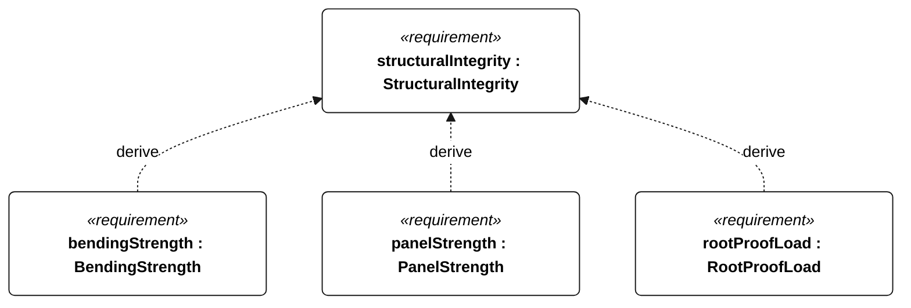
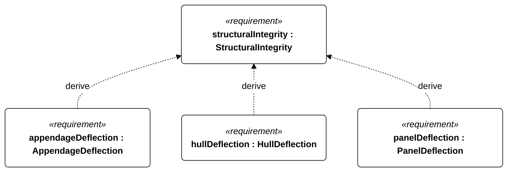

# FDM and wet-layup structural requirements

<!-- Generated from SysML by scripts/render_requirements.py; edit the model, not this file. -->

Proposed engineering allocations with open evidence. Satisfaction links allocate responsibility, not compliance. Material sources and model limits: structure-sizing.md.

| ID | Requirement | Statement | Basis and conditions |
| --- | --- | --- | --- |
| T-001 | HybridConstruction | The primary shell structure shall use an FDM substrate with wet-layup glass/epoxy reinforcement. | Owner-selected construction architecture. PETG is the initial candidate, not a qualified material. |
| T-100 | StructuralIntegrity | The primary structure shall carry its declared limit loads throughout the specified wet exposure. |  |
| T-101 | BendingStrength | Each primary structural member shall retain nonnegative bending-strength margin under the declared limit-load cases. | Use the documented wet/jointed laminate allowable. Analyze hull, wing, keel and rudder separately; no FDM strength credit. Grounding and ballast inertia are separate load cases. |
| T-102 | AppendageDeflection | Each wing, keel and rudder tip deflection shall be no greater than 2 percent of its unsupported span under the declared limit loads. | Proposed stiffness allocation preserves approximate foil geometry. Beam calculations do not cover shell buckling, fatigue or bond failure. |
| T-103 | HullDeflection | Hull longitudinal deflection shall be no greater than 0.5 percent of waterline length under the declared wave-bending load. | Proposed simply supported screening case: twice loaded vessel weight, uniformly distributed over waterline length. Not an ISO scantling assessment. |
| T-104 | PanelStrength | Each hull skin panel shall retain nonnegative bending-strength margin under 10 kPa differential pressure. | Proposed local pressure screen, approximately a metre of freshwater head; not a slamming or full survival-wave load. A simply supported strip spans between printed ribs. |
| T-105 | PanelDeflection | Hull skin panel deflection shall be no greater than 1 percent of rib spacing under 10 kPa differential pressure. | Glass-only flat-strip stiffness is credited; printed ribs supply the assumed support. Rib and bond validation remain required. |
| T-106 | RootProofLoad | Each appendage root attachment shall retain its load path under its declared limit-load proof test. | Independently test the largest calculated bending case, a 100 N tip load, and twice ballast weight transverse at the keel tip. Computed beam stress alone does not verify this attachment. |
| T-107 | WetCouponStrength | Wet-conditioned production laminate coupons shall demonstrate a bending allowable of at least 50 MPa. | Proposed target for the selected print, layup, joint and cure process after N-044 exposure. A datasheet value for neat resin is not laminate evidence. Use a lower measured allowable and re-size if this target is not substantiated. |
| T-108 | WetCouponStiffness | Wet-conditioned production laminate coupons shall demonstrate a flexural modulus of at least 10 GPa. | Proposed effective laminate target including joints; not a manufacturer claim or demonstrated property. Coupon orientation must cover the modeled primary directions. |
| T-109 | BondProof | Each representative glass-to-print joint shall retain its load path under its calculated limit-load proof test after N-044 exposure. | No qualified adhesion value is available; bond acceptance remains evidence-gated even when beam margins pass. |
| T-110 | LoadedFreeboard | The loaded hull shall retain at least 50 mm of geometric deck-edge freeboard at 20 degrees heel in calm water. | Proposed reserve geometry screen; not a promise of a dry deck in N-012 waves. Evaluate freeboard\*cos(heel)-beam/2\*sin(heel). |
| T-111 | ReserveBuoyancy | Intact enclosed volume above the loaded waterline shall provide reserve displacement of at least 100 percent of loaded vessel mass. | Proposed intact reserve criterion. Do not credit unsealed printed infill. Damage stability, capsize and downflooding require separate verification. |
| T-112 | LaunchClearance | The loaded vessel shall retain at least 0.30 m bottom clearance in 1.50 m water depth. | Proposed launch/retrieval site allocation supporting P-105 and P-106. The resulting immersed-depth limit is 1.20 m; actual site availability remains unverified. |
| T-113 | PrintTileEnvelope | Each structural print tile shall have positive extents no greater than 230 mm in X, Y and Z before supports and clearance. | 20 mm total allowance in each axis leaves room within the owner-selected 250 mm cube. CAD/slicer verification must still establish P-002; the mass model only estimates seam density. |

| Dependent element | Design basis | Rationale |
| --- | --- | --- |
| hybridConstruction | DesignIntent | Selected design allocation; the numerical value is not logically implied by the parent requirement. |
| structuralIntegrity | wetMechanicalIntegrity |  |
| loadedFreeboard | stabilityAndFouling | Selected design allocation; the numerical value is not logically implied by the parent requirement. |
| reserveBuoyancy | stabilityAndFouling | Selected design allocation; the numerical value is not logically implied by the parent requirement. |
| launchClearance | soloLaunch | Selected design allocation; the numerical value is not logically implied by the parent requirement. |
| printTileEnvelope | desktopManufacture | Selected design allocation; the numerical value is not logically implied by the parent requirement. |
| MaterialInputs | hybridConstruction |  |
