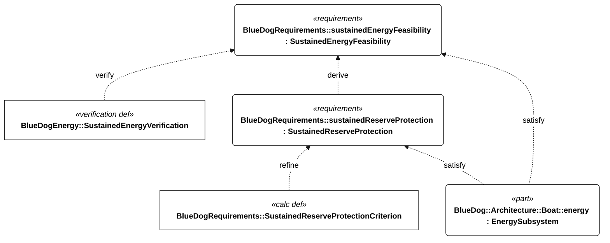

# Sustained operations: energy model and verification

The [native energy roll-up](energy-budget.md) sums component loads. [energy.sysml](../models/energy.sysml) propagates stored energy through an ordered mission profile and evaluates the energy requirements. [energy-examples.sysml](../models/energy-examples.sysml) contains an explicitly **synthetic** 72-hour campaign. The [published native results](analysis/sustained-energy.json) preserve the engine's inputs-derived outputs and verdicts.

## What the framework establishes

Each electrical load supplies active power, idle power, duty fraction, conversion efficiency and an uncertainty factor. Its battery-bus contribution is `(idle + (active - idle) * duty) * uncertainty / conversion efficiency`. The budget sums every owned load; adding a load automatically changes the roll-up. Peak power conservatively sums simultaneous active loads. Dependencies connect example loads to the logical architecture; they do not assert that those are separate circuit boards.

Each chronological interval references a budget and supplies its duration, harvesting-enabled state, available raw harvest power and harvesting efficiency. Different intervals can reference different budgets for sailing, low energy or other modes. An explicit `timeline` lists the interval references in chronological order; declaration/subsetting order does not determine the mission schedule. When adding an interval, also place it in that timeline. There are no invented observation defaults in the reusable definitions. The synthetic example uses overridable defaults so experiments can specialize it without changing the framework.

The battery model includes usable capacity after derating, charging/discharging efficiency, charging/discharging power limits and self-discharge. Initial energy is a conservative stored-energy estimate, bounded by usable capacity. Harvested bus power serves loads first. Surplus charges the battery subject to efficiency, charge-rate and capacity limits; deficits draw stored energy with discharge losses. Negative balances remain visible as deficits instead of being clamped to zero. The R-002 reserve calculation is reused unchanged, with separate battery-side motor and essential-load powers for recovery; the sailing motor remains off.

The profile is piecewise constant. Stored energy is monotone within each interval, so its initial value and interval endpoints cover its minimum **within this model**. Duty-cycle averages do not by themselves bound short bursts, shade outages or wave-induced actuator demand. Split intervals at such changes and validate the resolution before accepting evidence. The independent peak-power criterion covers supply power, not transient voltage sag or control-loop response.

## Acceptance and verification

<!-- diagram:energy-semantics -->

<!-- /diagram -->

Follow the [energy requirements](figures/requirements-e-200.md) and [qualification conditions](requirements-context.md). The analysis calls the same native criterion calculations as the requirements.

`modeledEnergyFeasible` combines valid inputs, reserve protection, repeatable balance, peak support and campaign coverage. `energyCaseSupported` additionally requires accepted evidence. The native `SustainedEnergyVerification` case explicitly verifies E-200, runs the analysis, and returns inconclusive without accepted evidence, pass for an accepted numerically feasible case, or fail for an accepted numerically failing case. Its objective separately requires `energyCaseSupported`; an inconclusive example is therefore not a successful verification command.

For a fixed profile, storage capacity and efficiencies, the energy transition is monotone in initial energy. If the first complete cycle never breaches reserve and ends no lower than it began, repeating the identical bounded profile preserves that property. This is a conditional energy argument, not proof of indefinite operation in arbitrary weather. Capacity aging, seasonal resource changes, faults, fouling and loss of functional performance remain outside that repetition assumption. The Gorge-to-Hawaii mission also needs route-specific profiles and physical functional evidence.

## Published results

Read the [generated load budget](energy-budget.md) and [native campaign output](analysis/sustained-energy.json) for current input-derived values and verdicts. The synthetic case is not a hardware selection or forecast.

## Run or extend a case

Run from the repository root:

```sh
uv run python scripts/render_requirements.py
uv run pytest -q
uv run python scripts/render_requirements.py --check
```

Publishing validates the models and writes both the native load table and JSON analysis report. It does not mark synthetic evidence accepted. No extra numerical Python dependency is needed.

For a custom case, add a SysML file specializing `BlueDogEnergy::Scenario` or the synthetic campaign, supply every required input, and load it with the project model set. Use the pinned CLI with:

```text
-instantiate YourPackage::scenario -analysis "BlueDogEnergy::SustainedOperation YourPackage::scenario" -json
```

For an evidence-reviewed case use:

```text
-instantiate YourPackage::scenario -analysis "BlueDogEnergy::SustainedEnergyVerification YourPackage::scenario" -json
```

These are arguments after the CLI executable and model filenames. To exercise a single requirement instead, bind the measured attributes of its definition and use `-requirement YourPackage::observedRequirement -json`. Keep units explicit and retain source measurements with the case. The recursive native trajectory calculation suits bounded design profiles; very large measured time series need coarsening justified by conservative bounds or a more scalable execution strategy.

## Evidence acceptance checklist

Set `evidenceAccepted` only after a reviewed evidence record identifies all of the following for the same installed configuration:

- Complete non-overlapping load coverage, including always-on electronics, radio retries, actuator demand, optional payload state, converters and quiescent losses. Do not count shared hardware once per logical responsibility or omit an installed load because it is unmeasured.
- Measured power bounds and duty cycles that still meet navigation, collision assessment, signaling, logging and communications requirements in each modeled mode. Saving energy by violating those functions does not establish sustained operation.
- Harvest bounds for the installed harvester and selected route/season, including shading, orientation and outages. M-002 replay must not exceed the recorded measured resource profile.
- Battery usable-energy and supply limits at the required temperature and end-of-service condition, conservative initial energy, and consistent definitions of the stored-energy and battery-bus boundaries. Convert recovery motor/essential powers to battery withdrawal rates before using R-002; reserve is protected inside usable capacity, not subtracted a second time.
- Interval resolution or conservative bounds that cover adverse ordering within each interval; measurement uncertainty; repeat-cycle phase; source-file identifiers, configuration revision and review disposition.

The Boolean is an explicit review gate, not an automatic audit of those records. The full M-002 endurance requirement still needs a 72-hour functional run, and actual indefinite operation cannot be established by a finite synthetic campaign.
