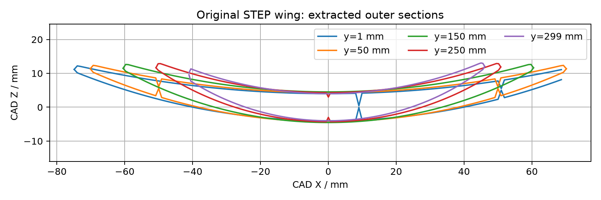

# CAD wing and VSPAERO reference analysis

<!-- Generated by scripts.publish_wing_analysis; do not edit numerical results here. -->

The reference wing is an integration and mesh-sensitivity exercise, **not a validated sizing polar**. It uses the CAD midsection in a rectangular free-air wing. Viscous/stall behavior, rounded-edge wake shedding, broadside flow, hull interference and both-tack operation remain unvalidated.

## Geometry

CAD source: `cad/SweptCrescentWing.STEP`. Length units: millimetres. CAD axes: X chord, Y span, Z section height.

Material volume of the imported solid: **0.231675 litres**. This is not sealed displacement volume.

| Span station (mm) | Chord (mm) | Outer area (mm²) | Missing envelope samples |
|---:|---:|---:|---:|
| 1 | 149.176 | Unavailable | 6 |
| 50 | 140.318 | 895.41 | 0 |
| 150 | 120.964 | 822.48 | 0 |
| 250 | 101.615 | 661.96 | 0 |
| 299 | 87.153 | 555.18 | 0 |

## Reference sweep

Tool: OpenVSP 3.54.0. Reference area 1 m²; aspect ratio 4; mast moment reference at mid-chord. CAD Z is reflected to give positive camber in aerodynamic axes. These dimensions are reference inputs, not frozen design requirements.

| Incidence (deg) | CL, mesh 16 | CL, mesh 32 | CL, mesh 64 | CDi, mesh 64 | CMy, mesh 64 |
|---:|---:|---:|---:|---:|---:|
| -4.0 | 0.37786 | 0.35937 | 0.33514 | 0.01032 | -0.13517 |
| 0.0 | 0.63723 | 0.61413 | 0.58658 | 0.03211 | -0.06777 |
| 4.0 | 0.89186 | 0.86545 | 0.83492 | 0.06560 | -0.00147 |
| 8.0 | 1.14538 | 1.11121 | 1.07680 | 0.11052 | 0.06293 |
| 12.0 | 1.38560 | 1.34720 | 1.31196 | 0.16593 | 0.12454 |

Maximum absolute CL change from mesh 32 to 64: **0.03524**. Mesh sensitivity does not validate the physical model. CDi is induced drag, not total sail drag. No observed stall limit is inferred from this sweep.

Next gates: geometry/axis verification, reference-solver verification, physically defensible aerodynamic coverage and uncertainty, full-angle hydrostatics, actuator/structure coupling, then feasibility and length optimization. See [coupled sizing](coupled-sizing.md).
